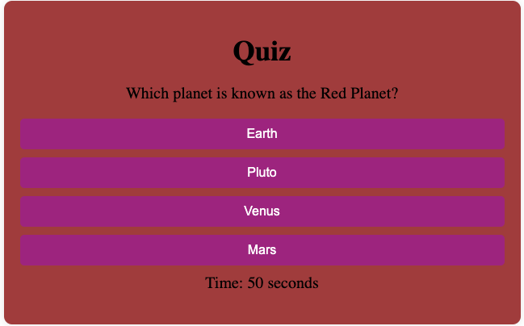

Dyaln Slyters quick quiz 

creating a quiz using html, css, and javascript

Description

My quiz meets requiremnts of going down 10 seconds when the wrong answer is selected, it starts quiz when the button is selected and after the last questions it asks for initials and then after, it shows your initials and the score you got.

Usage

Taking a quiz asking simple random questions showing how javascript works

Here is a screenshot 
